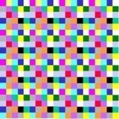

# Imagens digitais

**O que é uma imagem digital?**

Imagem digital é uma representação em duas dimensões de uma imagem como um conjunto finito de valores digitais, chamados de ****_pixel_.  Estas imagens são chamadas de duas dimensões 2D.

 _Pixel_ é o menor ponto que forma uma imagem digital, sendo que o conjunto de milhares de _pixels_ formam a imagem inteira.

**Resolução da imagem digital**

A resolução de uma imagem é a somatória de todos seus _pixel_, este calculo é feito multiplicando o numero de _pixel_ verticais pelo numero de _pixel_ horizontais.ddd

\*\*\*\*

**Imagem na forma digital**

A representação de Imagens na forma digital nos permite capturar, armazenar e processar imagens na forma eletrônica assim como processamos um texto em um computador.

Em computação gráfica pode-se classificar uma imagem, em relação à sua origem, de duas formas distintas:

**Vetorial**

A forma vetorial é normalmente utilizada por programas de desenho e os objetos que formam a imagem são representados na forma de lista indicando suas dimensões e posicionamento.

**Bitmap \(mapa de bits\)**

São as imagens produzidas por scanners, maquinas digitais e também equipamentos médicos.

Os pontos são amostrados e representados bit a bit. Um bitmap pode ser [monocromático](http://pt.wikipedia.org/wiki/Monocrom%C3%A1tico), em [escala de cinza](http://pt.wikipedia.org/wiki/Escala_de_cinza) ou [colorido](http://pt.wikipedia.org/wiki/Cor). Os [pixels](http://pt.wikipedia.org/wiki/Pixels) podem ser formados no padrão [RGB](http://pt.wikipedia.org/wiki/RGB), do inglês Red, Green, Blue, que utiliza três [números inteiros](http://pt.wikipedia.org/wiki/N%C3%BAmeros_inteiros) para representar as cores vermelho, verde e azul  ou serem representados por tons de cinza no caso de imagens preto e branco.

**Conversão de imagens analógicas para digitais**

\*\*\*\*

\*\*\*\*

